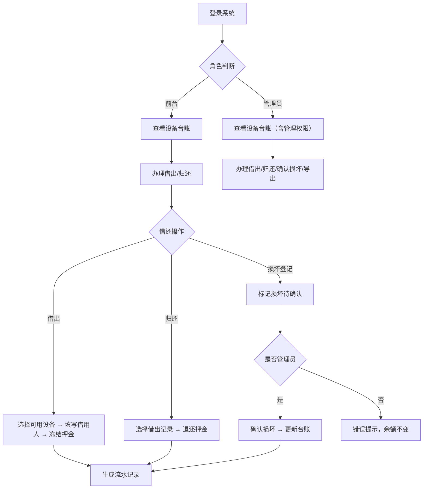

## 1. 产品概述

本地诊所设备借用与归还管理系统，用于管理轮椅、雾化器等可周转设备的借出、归还、损坏确认及押金冻结/退还全流程。目标用户为诊所前台工作人员和系统管理员，旨在替代手工登记，实现设备台账清晰、押金流水可追溯、操作权限分级的数字化管理。

## 2. 核心功能

### 2.1 用户角色

| 角色 | 登录方式 | 核心权限 |
|------|----------|----------|
| 前台 | 用户名密码登录 | 办理借出、归还、查看台账和流水 |
| 管理员 | 用户名密码登录 | 前台全部权限 + 确认损坏、调整台账、导出 CSV 记录 |

### 2.2 功能模块

1. **登录页**：用户名密码登录，区分前台/管理员角色
2. **设备台账页**：设备列表、新增设备、编辑设备、按状态/名称/类型筛选
3. **借还操作页**：办理借出（冻结押金）、归还（退还押金）、损坏登记
4. **押金流水页**：全部押金冻结/退还流水记录，按借用人/设备/类型筛选
5. **导出功能**：管理员可导出台账、借还记录、押金流水的 CSV 文件

### 2.3 页面详情

| 页面名称 | 模块名称 | 功能描述 |
|----------|----------|----------|
| 登录页 | 登录表单 | 用户名、密码输入，登录后按角色跳转 |
| 设备台账页 | 设备列表 | 展示所有设备，含名称、类型、状态、押金金额，支持按名称/类型/状态筛选 |
| 设备台账页 | 新增/编辑设备弹窗 | 管理员可新增设备或修改设备信息（名称、类型、押金金额、备注） |
| 设备台账页 | 设备详情抽屉 | 点击设备行展开详情，含押金变化时间线和每次操作人 |
| 借还操作页 | 借出登记 | 选择设备、填写借用人姓名/电话、冻结押金，已借出设备不可再借 |
| 借还操作页 | 归还登记 | 扫描/选择借出记录，退还押金，已归还不可重复退押金 |
| 借还操作页 | 损坏登记 | 标记设备损坏待确认，仅管理员可确认损坏（非管理员操作时给出错误提示且不改余额） |
| 押金流水页 | 流水列表 | 展示所有冻结/退还记录，含金额、类型、关联设备/借用人、操作人、时间 |
| 押金流水页 | 筛选器 | 按设备名称、借用人、流水类型筛选 |
| 导出功能 | CSV 导出 | 管理员可导出台账/借还记录/押金流水的 CSV 文件 |

## 3. 核心流程

### 3.1 设备借出流程
前台选择可用设备 → 填写借用人信息 → 系统冻结押金 → 设备状态变为"已借出" → 生成借出记录和押金冻结流水

### 3.2 设备归还流程
前台选择借出记录 → 确认归还 → 系统退还押金 → 设备状态变为"可用" → 生成归还记录和押金退还流水

### 3.3 损坏确认流程
前台/管理员发现设备损坏 → 标记"损坏待确认" → 管理员确认损坏 → 设备状态变为"已损坏" → 押金处理（扣减或退还）

### 3.4 流程图

## 4. 用户界面设计

### 4.1 设计风格
- **主色调**：深青色 (#0F766E) 作为主色，搭配暖橙色 (#F59E0B) 作为强调色
- **按钮风格**：圆角 (8px) 实心按钮，主要操作用主色，危险操作用红色
- **字体**：思源黑体 / Noto Sans SC，标题 20px 加粗，正文 14px 常规
- **布局风格**：左侧固定导航栏 + 右侧内容区，卡片式内容分区
- **图标风格**：线性图标 (Lucide Icons)

### 4.2 页面设计概览

| 页面名称 | 模块名称 | UI 元素 |
|----------|----------|---------|
| 登录页 | 登录表单 | 居中卡片，深青色头部标题，白色表单区域，输入框带图标前缀，主色登录按钮 |
| 设备台账页 | 设备列表 | 顶部筛选栏（状态标签组+搜索框），表格带斑马纹，状态标签用不同颜色区分 |
| 设备台账页 | 新增/编辑弹窗 | 居中模态框，表单含输入框和下拉选择，底部确认/取消按钮 |
| 设备台账页 | 设备详情抽屉 | 右侧滑出抽屉，顶部设备信息，中部押金变化时间线，底部操作人记录 |
| 借还操作页 | 借出表单 | 左右分栏，左侧设备选择列表，右侧借用人信息表单和押金显示 |
| 借还操作页 | 归还表单 | 借出记录列表，每行显示借用人/设备/时间，右侧操作按钮 |
| 押金流水页 | 流水列表 | 表格带类型图标，冻结用蓝色标签，退还用绿色标签，操作人显示在行尾 |
| 押金流水页 | 筛选器 | 顶部水平排列的下拉筛选器，支持快速切换 |

### 4.3 响应式设计
- 桌面优先设计，最小宽度 1024px
- 导航栏固定在左侧，内容区域自适应宽度
- 表格支持水平滚动以适应窄屏

### 4.4 3D 场景指导
- 不适用
