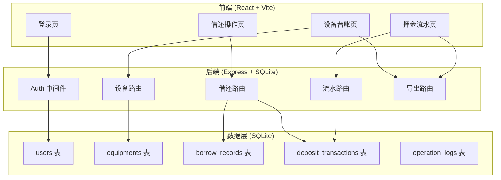
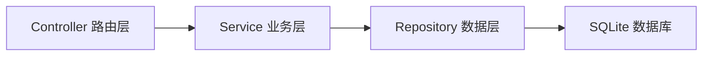
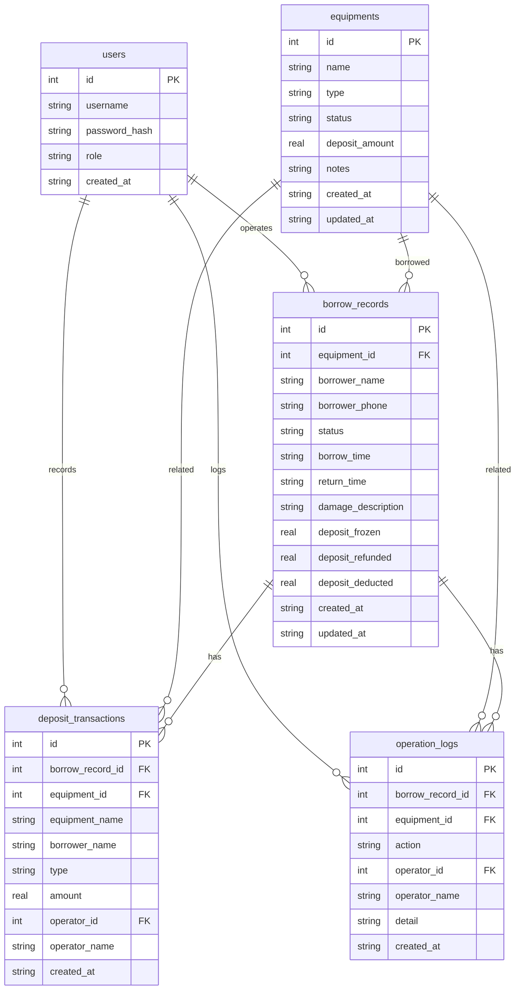

## 1. 架构设计



## 2. 技术说明

- **前端**：React@18 + TailwindCSS@3 + Vite
- **初始化工具**：Vite (react-ts 模板)
- **后端**：Express@4 + better-sqlite3
- **数据库**：SQLite (本地文件存储，重启数据不丢失)
- **认证**：JWT (jsonwebtoken)，登录后携带 token 访问接口
- **导出**：后端生成 CSV 文件，前端触发下载

## 3. 路由定义

| 路由 | 用途 |
|------|------|
| `/login` | 登录页面 |
| `/` | 设备台账主页（默认页） |
| `/borrow-return` | 借还操作页 |
| `/deposit-log` | 押金流水页 |

## 4. API 定义

### 4.1 认证接口

```
POST /api/auth/login
  Request:  { username: string, password: string }
  Response: { token: string, user: { id, username, role } }

GET /api/auth/me
  Headers:  Authorization: Bearer <token>
  Response: { id, username, role }
```

### 4.2 设备接口

```
GET    /api/equipments?status=&name=&type=
  Response: Equipment[]

POST   /api/equipments           [管理员]
  Request:  { name, type, deposit_amount, notes }
  Response: Equipment

PUT    /api/equipments/:id       [管理员]
  Request:  { name?, type?, deposit_amount?, notes?, status? }
  Response: Equipment

GET    /api/equipments/:id/detail
  Response: Equipment & { deposit_timeline: DepositTransaction[], operation_logs: OperationLog[] }
```

### 4.3 借还接口

```
POST   /api/borrows              [已登录]
  Request:  { equipment_id, borrower_name, borrower_phone }
  Response: BorrowRecord & { deposit_transaction: DepositTransaction }

PUT    /api/borrows/:id/return   [已登录]
  Response: BorrowRecord & { deposit_transaction: DepositTransaction }

PUT    /api/borrows/:id/damage   [已登录]
  Request:  { description: string }
  Response: BorrowRecord

PUT    /api/borrows/:id/confirm-damage  [管理员]
  Request:  { deposit_deducted: number }
  Response: BorrowRecord & { deposit_transaction?: DepositTransaction }

GET    /api/borrows?status=&borrower_name=&equipment_name=
  Response: BorrowRecord[]
```

### 4.4 押金流水接口

```
GET    /api/deposits?borrower_name=&equipment_name=&type=
  Response: DepositTransaction[]
```

### 4.5 导出接口 [管理员]

```
GET    /api/export/equipments     → CSV 文件下载
GET    /api/export/borrows        → CSV 文件下载
GET    /api/export/deposits       → CSV 文件下载
```

### 4.6 TypeScript 类型定义

```typescript
interface User {
  id: number;
  username: string;
  password_hash: string;
  role: "admin" | "front_desk";
  created_at: string;
}

interface Equipment {
  id: number;
  name: string;
  type: string;
  status: "available" | "borrowed" | "damaged" | "pending_confirm";
  deposit_amount: number;
  notes: string;
  created_at: string;
  updated_at: string;
}

interface BorrowRecord {
  id: number;
  equipment_id: number;
  equipment_name: string;
  borrower_name: string;
  borrower_phone: string;
  status: "borrowed" | "returned" | "damaged" | "pending_confirm";
  borrow_time: string;
  return_time: string | null;
  damage_description: string | null;
  deposit_frozen: number;
  deposit_refunded: number;
  deposit_deducted: number;
  created_at: string;
  updated_at: string;
}

interface DepositTransaction {
  id: number;
  borrow_record_id: number;
  equipment_id: number;
  equipment_name: string;
  borrower_name: string;
  type: "freeze" | "refund" | "deduct";
  amount: number;
  operator_id: number;
  operator_name: string;
  created_at: string;
}

interface OperationLog {
  id: number;
  borrow_record_id: number | null;
  equipment_id: number | null;
  action: string;
  operator_id: number;
  operator_name: string;
  detail: string;
  created_at: string;
}
```

## 5. 服务端架构图



## 6. 数据模型

### 6.1 数据模型定义



### 6.2 数据定义语言

```sql
CREATE TABLE users (
  id INTEGER PRIMARY KEY AUTOINCREMENT,
  username TEXT NOT NULL UNIQUE,
  password_hash TEXT NOT NULL,
  role TEXT NOT NULL CHECK(role IN ('admin', 'front_desk')),
  created_at TEXT NOT NULL DEFAULT (datetime('now', 'localtime'))
);

CREATE TABLE equipments (
  id INTEGER PRIMARY KEY AUTOINCREMENT,
  name TEXT NOT NULL,
  type TEXT NOT NULL,
  status TEXT NOT NULL DEFAULT 'available' CHECK(status IN ('available', 'borrowed', 'damaged', 'pending_confirm')),
  deposit_amount REAL NOT NULL DEFAULT 0,
  notes TEXT DEFAULT '',
  created_at TEXT NOT NULL DEFAULT (datetime('now', 'localtime')),
  updated_at TEXT NOT NULL DEFAULT (datetime('now', 'localtime'))
);

CREATE TABLE borrow_records (
  id INTEGER PRIMARY KEY AUTOINCREMENT,
  equipment_id INTEGER NOT NULL REFERENCES equipments(id),
  borrower_name TEXT NOT NULL,
  borrower_phone TEXT NOT NULL,
  status TEXT NOT NULL DEFAULT 'borrowed' CHECK(status IN ('borrowed', 'returned', 'damaged', 'pending_confirm')),
  borrow_time TEXT NOT NULL DEFAULT (datetime('now', 'localtime')),
  return_time TEXT,
  damage_description TEXT,
  deposit_frozen REAL NOT NULL DEFAULT 0,
  deposit_refunded REAL NOT NULL DEFAULT 0,
  deposit_deducted REAL NOT NULL DEFAULT 0,
  created_at TEXT NOT NULL DEFAULT (datetime('now', 'localtime')),
  updated_at TEXT NOT NULL DEFAULT (datetime('now', 'localtime'))
);

CREATE TABLE deposit_transactions (
  id INTEGER PRIMARY KEY AUTOINCREMENT,
  borrow_record_id INTEGER NOT NULL REFERENCES borrow_records(id),
  equipment_id INTEGER NOT NULL REFERENCES equipments(id),
  equipment_name TEXT NOT NULL,
  borrower_name TEXT NOT NULL,
  type TEXT NOT NULL CHECK(type IN ('freeze', 'refund', 'deduct')),
  amount REAL NOT NULL,
  operator_id INTEGER NOT NULL REFERENCES users(id),
  operator_name TEXT NOT NULL,
  created_at TEXT NOT NULL DEFAULT (datetime('now', 'localtime'))
);

CREATE TABLE operation_logs (
  id INTEGER PRIMARY KEY AUTOINCREMENT,
  borrow_record_id INTEGER REFERENCES borrow_records(id),
  equipment_id INTEGER REFERENCES equipments(id),
  action TEXT NOT NULL,
  operator_id INTEGER NOT NULL REFERENCES users(id),
  operator_name TEXT NOT NULL,
  detail TEXT DEFAULT '',
  created_at TEXT NOT NULL DEFAULT (datetime('now', 'localtime'))
);

-- 初始数据：管理员和前台账号
INSERT INTO users (username, password_hash, role) VALUES
  ('admin', '$2a$10$placeholder_admin_hash', 'admin'),
  ('front_desk', '$2a$10$placeholder_front_hash', 'front_desk');

-- 初始样例设备
INSERT INTO equipments (name, type, deposit_amount, status) VALUES
  ('轮椅-001', '轮椅', 200.00, 'available'),
  ('轮椅-002', '轮椅', 200.00, 'available'),
  ('雾化器-001', '雾化器', 150.00, 'available'),
  ('血压计-001', '血压计', 100.00, 'available');
```
